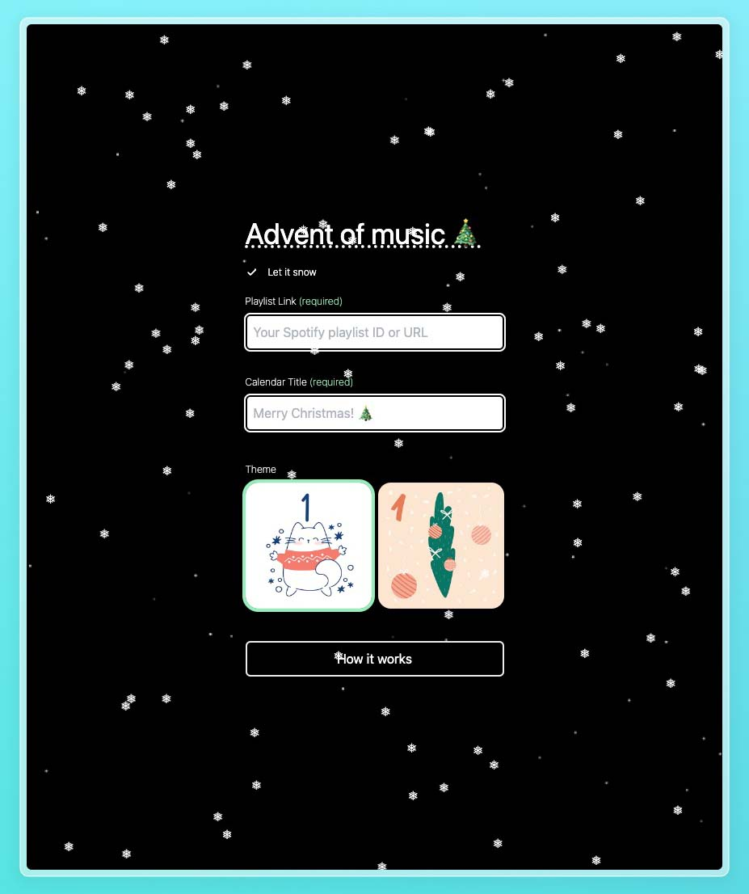

# Advent of music

Ever wanted to accompany your friends with some music during christmas time? Well, now you can!  
[Live](https://create.adventofmusic.app)

## Requirements

- Node.js v20 or higher
- Supabase account
- Spotify Premium account
- Hosting provider (e.g. Vercel)

## Setup

- `pnpm -r i` to install dependencies
- `pnpm dev` to start the development server

## Built with

- Nuxt & Nuxt Layers
- Supabase
- Tailwind
- Valibot
- Temporal
- Slugify
- Christmas spirit
